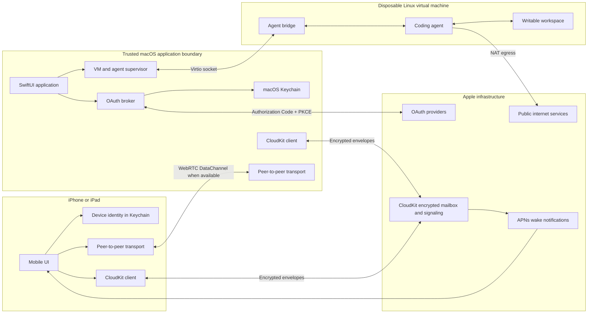
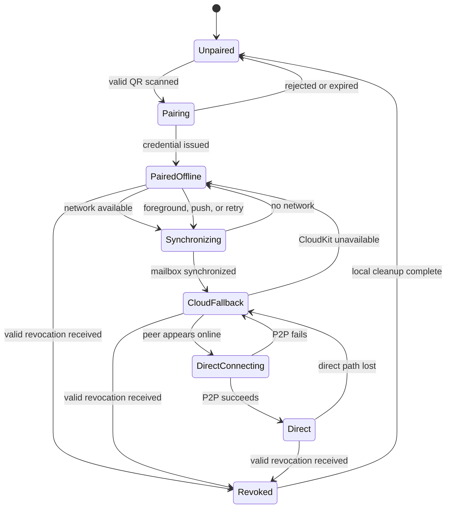

# Sandboxed Agent System Design

## Status

Exploration / proposed architecture

## Summary

This system packages a coding agent inside a self-contained native macOS application. The agent runs in an isolated Linux virtual machine, can access the public internet, supports OAuth authentication through the host application, and exchanges messages with an iPhone or iPad app paired through a QR code.

The design does not require the user to install Docker, Homebrew, Tailscale, or a separate virtual-machine manager. It also avoids operating a custom relay service by using CloudKit for pairing, signaling, offline delivery, and encrypted fallback messages. When networking conditions allow, the Mac and mobile device communicate directly over a peer-to-peer connection. The mobile feature depends on an available iCloud account and CloudKit.

The initial product targets Apple silicon Macs and Apple mobile devices.

## Goals

- Distribute the Mac experience as one signed and notarized application.
- Run agent-controlled code outside the macOS process and filesystem boundary.
- Give the Linux guest ordinary outbound public-internet access.
- Avoid exposing host files unless the user explicitly imports them.
- Perform OAuth through the native Mac interface.
- Keep long-lived provider credentials outside the Linux guest where possible.
- Pair a mobile device by scanning a short-lived QR code.
- Prefer direct peer-to-peer communication without requiring router configuration.
- Continue delivering encrypted messages when direct networking is unavailable.
- Avoid operating a custom coordination, signaling, or message-relay service.
- Make the sandbox easy to reset or destroy.

## Non-goals for the first version

- Supporting Intel Macs.
- Running arbitrary Docker Compose environments.
- Providing Docker compatibility inside the guest.
- Hiding the Mac's public IP behind a remote egress proxy.
- Guaranteeing a direct peer-to-peer connection on every network.
- Supporting Android or Windows mobile clients.
- Protecting the guest from a compromised macOS host.
- Protecting data that the user deliberately imports into a guest with unrestricted internet access.

## High-level architecture



## 1. Self-contained sandbox

### 1.1 Virtualization technology

The Mac application uses Apple's `Virtualization.framework` directly. It bundles or provisions:

- An ARM64 Linux kernel.
- A minimal immutable Linux root filesystem.
- A small guest initialization process.
- The coding-agent runtime.
- The guest-side agent bridge.

No Docker installation is required. The application creates and controls a `VZVirtualMachine` itself.

The first release should target:

- Apple silicon.
- macOS 15 or newer, subject to validation during implementation.
- At least 8 GB of system memory.
- Approximately 15–30 GB of available storage for the guest and its workspaces.

Apple's newer Containerization Swift package may eventually reduce the amount of custom VM orchestration required. It currently targets Apple silicon and macOS 26 and should be treated as a possible future backend rather than a requirement for the first implementation.

### 1.2 Application layout

An illustrative installation layout is:

```text
Agent.app
├── Contents/
│   ├── MacOS/
│   │   ├── Agent
│   │   └── AgentHelper
│   └── Resources/
│       ├── vmlinux-arm64
│       ├── initramfs
│       └── agent-rootfs.squashfs
└── ~/Library/Application Support/Agent/
    ├── identity/
    └── instances/
        └── <instance-id>/
            ├── writable.img
            ├── configuration.json
            └── snapshots/
```

The signed application contains immutable runtime resources. Writable VM disks, downloaded updates, instance configuration, and snapshots live in the application's Application Support directory.

### 1.3 Guest filesystem

The guest uses two primary storage layers:

1. An immutable system image containing the operating system and agent runtime.
2. A per-instance writable disk containing code, installed packages, logs, and temporary state.

The guest does not receive a general-purpose host filesystem share. Source code enters the guest through an explicit import operation. Artifacts leave through an explicit export operation.

Resetting an instance deletes its writable disk and creates a new one from the immutable base image. The UI must clearly distinguish:

- Stop: preserve the writable disk.
- Restart: reboot the existing instance.
- Reset: discard all guest changes and credentials.
- Delete: remove the instance and its local metadata.

### 1.4 Host-to-guest control channel

The host application communicates with the guest through a virtio socket rather than an exposed TCP port. The guest bridge listens only on the VM's virtio-socket endpoint.

This channel carries typed protocol messages such as:

```text
conversation.send
conversation.cancel
output.delta
output.completed
tool.approval.requested
tool.approval.respond
oauth.requested
oauth.completed
sandbox.status
artifact.import
artifact.export.requested
```

The mobile application cannot invoke arbitrary host shell commands. Mobile requests enter the agent protocol and remain subject to the Mac application's validation and approval policies.

### 1.5 Unlockable developer access with SSH and SCP

The Mac application provides an optional Developer Access feature for customizing the live guest with ordinary developer tools. It is disabled by default and is intended for local programs on the same Mac, including Terminal and a user's normal Codex installation.

Developer Access does not require a special Codex integration. Codex uses its terminal to run the same `ssh` and `scp` commands that a human would run.

When the user enables Developer Access, the application:

1. Starts or unlocks `sshd` inside the Linux guest.
2. Binds a random localhost-only port such as `127.0.0.1:49152`.
3. Forwards that port through a host-controlled virtio-socket tunnel to guest port 22 without exposing it to the LAN, public internet, or general guest NAT interface.
4. Generates a per-instance or short-lived SSH key.
5. Pins the guest host key in an application-managed `known_hosts` file.
6. Writes an application-managed SSH configuration file.
7. Displays copyable commands and instructions for Terminal or Codex.
8. Disables access when its timer expires, the user locks it, or the VM stops.

An illustrative generated configuration is:

```sshconfig
Host agentbox-development
    HostName 127.0.0.1
    Port 49152
    User agent
    IdentityFile /path/to/instance/access-key
    UserKnownHostsFile /path/to/instance/known_hosts
    StrictHostKeyChecking yes
    IdentitiesOnly yes
    PasswordAuthentication no
    ForwardAgent no
    ForwardX11 no
```

The application keeps this configuration separate from the user's normal `~/.ssh/config`. Commands select it explicitly:

```bash
ssh -F "/path/to/agentbox-ssh-config" agentbox-development
```

Codex should normally use noninteractive SSH commands so that each operation produces captured output and a reliable exit status:

```bash
ssh -F "/path/to/agentbox-ssh-config" \
  agentbox-development \
  'cd /workspace && git status --short'

ssh -F "/path/to/agentbox-ssh-config" \
  agentbox-development \
  'cd /workspace && npm test'
```

SCP provides explicit file transfer in both directions:

```bash
scp -F "/path/to/agentbox-ssh-config" \
  ./setup.sh \
  agentbox-development:/workspace/

scp -F "/path/to/agentbox-ssh-config" \
  agentbox-development:/workspace/build/output.zip \
  ./
```

The guest image includes the OpenSSH server and SFTP subsystem. The application can enable SSH connection multiplexing in its generated configuration to make repeated commands inexpensive.

The UI includes a **Copy instructions for Codex** action that produces a short prompt similar to:

```text
The development environment is available over SSH.

SSH configuration: /path/to/agentbox-ssh-config
Remote host: agentbox-development
Remote workspace: /workspace

Run project commands remotely using:
  ssh -F "/path/to/agentbox-ssh-config" \
    agentbox-development \
    'cd /workspace && <command>'

Use scp with the same -F configuration to transfer files. Do not run the
project's builds or tests on the local Mac.
```

SSH access is key-only. Password authentication, root login, SSH-agent forwarding, X11 forwarding, and TCP forwarding are disabled initially. The `agent` guest account may have passwordless `sudo` because the VM is disposable, but the UI must explain that Developer Access grants full control over the instance, including any credentials stored inside it.

Unlocking SSH creates a second control path that bypasses normal agent tool approvals. It therefore requires an explicit user action, has a visible active state, and is included in the local audit log.

## 2. Guest networking

### 2.1 Initial network model

The virtual machine uses a `VZVirtioNetworkDeviceConfiguration` with standard NAT networking. The guest can make outbound connections to public internet services through the Mac's active network connection.

The first version does not require:

- A remote SOCKS proxy.
- A VPN exit node.
- A user-managed network policy.
- Public inbound ports.
- Router port forwarding.

No guest service is deliberately exposed on the Mac's LAN or public interface.

### 2.2 Security limitation

Standard NAT networking may allow the guest to attempt connections to private-network destinations. This is weaker than a strict public-internet-only policy.

If testing shows that local-network isolation is required, a later release can introduce a host-controlled packet filter that blocks:

- IPv4 private ranges.
- IPv6 unique-local ranges.
- Loopback.
- Link-local networks.
- The host-side virtual gateway, except for explicitly required services.

Filtering inside the Linux guest alone is not considered a strong security boundary because agent-controlled code may obtain root privileges inside the guest.

## 3. OAuth and credentials

### 3.1 OAuth flow

OAuth is initiated by the guest but performed by the native Mac application:

1. The guest sends an OAuth request containing the provider, requested scopes, purpose, and correlation identifier.
2. The Mac validates the provider and scopes.
3. The Mac shows a native consent surface.
4. The Mac launches `ASWebAuthenticationSession`.
5. The authorization uses Authorization Code with PKCE.
6. The Mac receives the callback and exchanges the authorization code.
7. The refresh token and account metadata are stored in macOS Keychain.
8. The guest receives a scoped credential capability or short-lived access token.

Example request:

```json
{
  "type": "oauth.request",
  "request_id": "01J...",
  "provider": "github",
  "scopes": ["repo"],
  "purpose": "Clone and push repositories"
}
```

### 3.2 Credential levels

Credential handling follows this preference order:

1. Host-side authenticated request broker; no provider token enters the guest.
2. Short-lived access token copied into the guest; refresh token remains in Keychain.
3. Full sandbox-local session for tools that cannot use a brokered credential.

The UI must warn the user when a credential or browser session will be accessible to guest code. Sandbox-local credentials should be revoked or invalidated when the sandbox is reset or deleted.

### 3.3 Authenticated browsers

If a browser runs inside the guest, its cookies and authenticated session are accessible to guest code. The system cannot both give the guest a general authenticated browser session and hide that session from the guest.

Provider APIs and host-brokered credentials are therefore preferred over arbitrary authenticated browser automation.

## 4. Mobile pairing and connectivity

### 4.1 Transport strategy

The system uses two complementary transports:

- A direct peer-to-peer connection when NAT traversal succeeds.
- An end-to-end encrypted CloudKit mailbox when direct connectivity is unavailable or either device was offline.

CloudKit also provides the signaling path needed to establish the direct connection. The product does not operate its own signaling or relay service.

### 4.2 Why a fallback is necessary

NAT hole punching is not universally reliable. Direct UDP may fail on cellular networks, corporate Wi-Fi, blocked-UDP networks, or networks using hard or symmetric NAT.

A QR code can bootstrap trust, but it cannot by itself provide continuous signaling after IP addresses and NAT mappings change. A durable coordination path remains necessary for reconnection, offline delivery, and background operation.

CloudKit fills that role while keeping message contents end-to-end encrypted between the paired applications.

### 4.3 QR payload

The Mac creates a short-lived pairing session and displays a QR code containing data similar to:

```json
{
  "type": "agent-link-pairing",
  "version": 1,
  "rendezvous_id": "...",
  "mac_device_id": "...",
  "mac_display_name": "Nathan's MacBook Pro",
  "mac_signing_public_key": "...",
  "mac_pairing_public_key": "...",
  "pairing_secret": "...",
  "expires_at": "..."
}
```

Section 13.7 defines the canonical validation and processing rules for this payload.

The payload must not contain OAuth credentials, conversation content, CloudKit account tokens, or reusable device secrets.

### 4.4 Pairing protocol

1. The Mac generates an ephemeral X25519 keypair and one-time pairing secret.
2. It creates a CloudKit rendezvous record identified by a high-entropy random identifier.
3. The iPhone scans the QR code and validates its version and expiration.
4. The iPhone generates its own long-lived device identity and an ephemeral pairing key.
5. It posts an authenticated, encrypted response to the rendezvous record.
6. The Mac optionally asks the user to approve the new device.
7. Both devices derive shared session material using the exchanged keys and pairing secret.
8. The Mac issues the mobile device a signed application-level device credential.
9. The rendezvous record and one-time secret are invalidated.
10. Long-lived private keys are stored in the respective platform Keychains.

Every paired device has a distinct identity and can be revoked independently.

### 4.5 Direct connection

After pairing, the devices exchange encrypted ICE candidates through CloudKit and attempt to establish a direct WebRTC data channel. Candidate gathering requires a production-approved STUN service, but STUN carries only endpoint-discovery traffic and does not relay application messages. The first version does not operate or depend on a TURN relay; when direct traversal fails, encrypted CloudKit delivery remains active.

The direct connection is used for:

- Low-latency prompt submission.
- Streaming agent output.
- Cancellation.
- Tool approvals.
- Presence and health updates.

Direct payloads remain authenticated and encrypted at the application layer, even if the chosen transport already provides encryption.

### 4.6 CloudKit fallback

If direct networking fails, each side writes encrypted envelopes to CloudKit:

```json
{
  "version": 1,
  "sender_device_id": "...",
  "recipient_device_id": "...",
  "message_id": "...",
  "conversation_id": "...",
  "sequence": 184,
  "epoch": 7,
  "created_at": "...",
  "expires_at": "...",
  "nonce": "...",
  "ciphertext": "...",
  "signature": "..."
}
```

This is the `EncryptedEnvelope` defined in Section 7; both transports carry the same protocol object.

CloudKit sees routing metadata and ciphertext but not prompts, responses, OAuth credentials, or encryption keys.

The fallback transport should:

- Batch streaming output into chunks rather than writing individual tokens.
- Deduplicate by message identifier.
- Preserve sequence ordering per conversation.
- Acknowledge successfully processed messages.
- Delete or expire acknowledged records.
- Retry safely after process restarts.
- Impose message, storage, and retention limits.

The UI should display the active connection mode:

- Direct.
- Cloud fallback.
- Mac offline.

### 4.7 CloudKit database choice

If the Mac and mobile device use the same Apple ID, the private CloudKit database is the simplest initial implementation.

Supporting different Apple IDs requires either:

- CloudKit shared records and an invitation flow.
- An encrypted mailbox in the public database.

Cross-account pairing should be deferred until the same-account experience is working reliably.

### 4.8 Background behavior

CloudKit subscriptions and APNs notify the mobile app when new encrypted data is available. Notifications contain only an opaque event or record identifier.

The Mac uses a signed background helper registered as a login item so it can receive queued work while the main UI is closed. A sleeping or powered-off Mac cannot be assumed to wake for an incoming agent message. Messages remain queued until the Mac resumes and reconnects.

## 5. macOS application components

### 5.1 SwiftUI application

Responsibilities include:

- First-run setup.
- Creating, stopping, resetting, and deleting agent instances.
- OAuth consent and account management.
- QR-code display and paired-device management.
- Conversation UI.
- Tool and artifact approvals.
- Guest resource configuration.
- Update and diagnostic surfaces.

### 5.2 Background helper

A signed helper registered through `SMAppService` manages:

- VM lifecycle while the main window is closed.
- CloudKit subscriptions and queued messages.
- Peer-to-peer connectivity.
- Guest bridge reconnection.
- Health monitoring.
- Graceful shutdown.

The helper and main application communicate over an authenticated XPC interface. The helper should not run as root unless a later networking feature makes that strictly necessary.

### 5.3 VM supervisor

The supervisor owns all `Virtualization.framework` objects and implements an internal abstraction such as:

```swift
protocol SandboxBackend {
    func create(configuration: SandboxConfiguration) async throws -> SandboxID
    func start(_ id: SandboxID) async throws
    func stop(_ id: SandboxID) async throws
    func restart(_ id: SandboxID) async throws
    func reset(_ id: SandboxID) async throws
    func destroy(_ id: SandboxID) async throws
    func importArtifact(_ source: URL, into id: SandboxID) async throws
    func exportArtifact(_ path: String, from id: SandboxID) async throws -> URL
}
```

This abstraction allows the implementation to adopt Apple Containerization or another backend later without changing the rest of the product.

## 6. Mobile application components

The first iOS/iPadOS application includes:

- QR scanner.
- Device identity stored in Keychain.
- CloudKit mailbox and subscriptions.
- A transport abstraction with CloudKit implemented first and direct WebRTC added after durable delivery is proven.
- Conversation list and chat interface.
- Streaming output display.
- Cancellation and approval controls.
- Mac and sandbox health status.
- Device revocation and re-pairing.

The first release should avoid remote file browsing and arbitrary shell access. Those features expand the protocol and security surface substantially.

## 7. Protocol properties

The protocol separates the application message from its encrypted transport envelope. An `AgentMessage` is decrypted only at an authorized endpoint immediately before local processing. The Mac application may then pass the authorized message body to the guest agent through the typed bridge:

```json
{
  "version": 1,
  "message_id": "01J...",
  "conversation_id": "01J...",
  "sender_device_id": "...",
  "sequence": 184,
  "type": "conversation.send",
  "sent_at": "...",
  "body": {}
}
```

Before transmission, the sender canonically encodes and encrypts that message into an `EncryptedEnvelope`:

```json
{
  "version": 1,
  "message_id": "01J...",
  "conversation_id": "01J...",
  "sender_device_id": "...",
  "recipient_device_id": "...",
  "sequence": 184,
  "epoch": 7,
  "created_at": "...",
  "expires_at": "...",
  "nonce": "...",
  "ciphertext": "...",
  "signature": "..."
}
```

The signature covers the canonical authenticated header and ciphertext. The same encrypted envelope is carried over WebRTC or stored in CloudKit, so changing transports does not change the security protocol.

Required protocol characteristics:

- Authenticated devices.
- End-to-end encryption.
- Replay protection.
- Monotonic sequence numbers per stream.
- Idempotent message handling.
- Explicit acknowledgements.
- Bounded payload sizes.
- Protocol-version negotiation.
- Safe recovery after reconnects and duplicate delivery.

Agent output is untrusted content. Mobile and Mac clients must not render it as active HTML or automatically execute links, scripts, terminal escape sequences, or embedded commands.

## 8. Threat model

### 8.1 Intended protections

The design aims to ensure that:

- Agent-controlled code runs under a separate Linux kernel.
- The guest cannot access arbitrary host files.
- The guest cannot invoke arbitrary host operations through the bridge.
- Resetting the instance removes its writable environment.
- Long-lived OAuth tokens normally stay in macOS Keychain.
- CloudKit cannot decrypt application messages.
- A lost mobile device can be revoked independently.
- QR pairing secrets are short-lived and single-use.
- Revocation rotates the active session epoch so the revoked device cannot decrypt future envelopes.

### 8.2 Explicit limitations

The design does not protect against:

- A compromised macOS host or compromised signed application.
- Exfiltration of data intentionally imported into an internet-enabled guest.
- Credentials intentionally stored inside the guest.
- A user approving malicious OAuth scopes or tool operations.
- Prompt injection influencing agent decisions.
- Local-network probing until a host-enforced egress filter is implemented.
- Traffic-analysis metadata visible to Apple or the user's network provider.
- Loss of availability while the Mac is asleep, offline, or powered off.
- Revocation cannot erase messages or keys that a device legitimately received before it was revoked.

## 9. Distribution and updates

The Mac application should be distributed as a Developer ID-signed and notarized DMG or installer. Mac App Store distribution is not an initial requirement.

The release process must sign and verify:

- The main application.
- The background helper.
- All bundled native executables.
- VM kernel and root-filesystem manifests.
- Downloaded guest updates.

The app should verify a signed manifest and cryptographic digest before booting any guest image. Updates should be atomic and retain the previous known-good base image for rollback.

Open-source license obligations for the Linux kernel, distribution packages, agent runtime, and bundled tools must be included in the product's notices and source-offer process where applicable.

## 10. Suggested implementation sequence

### Phase 1: Local VM proof of concept

- Boot a bundled ARM64 Linux image with `Virtualization.framework`.
- Add writable storage and NAT networking.
- Start a simple guest bridge over virtio sockets.
- Stream a local agent conversation between the Mac UI and guest.
- Implement stop, restart, reset, and delete.

### Phase 2: Host integration

- Add the background helper and authenticated XPC interface.
- Add file import and artifact export.
- Add localhost-only SSH forwarding, generated SSH configuration, and SCP support.
- Add Developer Access locking, expiration, host-key pinning, and copyable Codex instructions.
- Add Keychain-backed application identity.
- Add OAuth with `ASWebAuthenticationSession` and PKCE.
- Implement one provider end to end.

### Phase 3: Mobile pairing

- Build the iOS QR scanner.
- Implement the one-time pairing protocol.
- Store device identities in Keychain.
- Add paired-device listing and revocation.

### Phase 4: Cloud transport

- Implement the encrypted CloudKit mailbox.
- Add subscriptions, acknowledgements, retries, deduplication, and expiration.
- Implement queued prompts and batched response chunks.
- Add APNs wake notifications.

### Phase 5: Direct transport

- Exchange ICE candidates through CloudKit.
- Select and configure a production STUN dependency.
- Establish a WebRTC data channel.
- Prefer direct streaming and fall back transparently to CloudKit.
- Surface connection mode and diagnostics.

### Phase 6: Hardening

- Fuzz the host/guest and mobile protocols.
- Add resource, message, and storage quotas.
- Audit guest image provenance and update signing.
- Test hostile guest workloads.
- Test offline, sleeping, duplicate-delivery, and network-change behavior.
- Evaluate host-enforced private-network filtering.
- Complete notarization and update rollback testing.

## 11. Key product decisions

| Area | Initial decision |
|---|---|
| Host platform | Apple silicon Mac |
| Sandbox | Linux VM using `Virtualization.framework` |
| External runtime | None |
| Guest internet | Standard NAT egress |
| Host filesystem | No general share; explicit import/export only |
| Host/guest IPC | Virtio socket |
| Developer access | Optional localhost-only SSH and SCP |
| Codex integration | Codex runs ordinary noninteractive SSH commands through its terminal |
| SSH exposure | Disabled by default; never exposed to LAN or public internet |
| OAuth | Host-side Authorization Code + PKCE |
| Secret storage | macOS and iOS Keychain |
| Mobile pairing | Short-lived QR bootstrap |
| Signaling | CloudKit |
| Primary transport | WebRTC DataChannel when available |
| Fallback transport | E2E-encrypted CloudKit mailbox |
| Custom backend service | None |
| Initial account assumption | Same Apple ID on Mac and mobile |
| Mobile cloud dependency | iCloud and CloudKit required for the initial mobile feature |
| Mobile deployment target | iOS 17 or later for the sample, subject to implementation validation |
| Distribution | Developer ID-signed and notarized download |

## 12. Open questions

- Which coding-agent runtime and model providers are required initially?
- Should guest state persist indefinitely or expire after a configurable period?
- How large may imported repositories and exported artifacts be?
- Does the first release need Git operations with host-brokered GitHub credentials?
- Is macOS 15 support important enough to avoid macOS 26-only Containerization APIs?
- Is same-Apple-ID pairing acceptable for the first mobile release?
- Is CloudKit fallback latency acceptable for conversation output when P2P fails?
- Should the Mac process queued prompts automatically or require local approval?
- Which tool operations require approval from the Mac, the mobile app, or either?
- Is strict private-network blocking required before public release?
- Which managed STUN endpoint is acceptable for production peer-to-peer candidate discovery?

## 13. Sample mobile application implementation plan

### 13.1 Objective

Build a small native iPhone application that can:

1. Scan a pairing QR code displayed by the Mac application.
2. Establish and persist a trusted relationship with that Mac.
3. Send prompts to the Mac and receive agent output.
4. Recover automatically after either application restarts, a device goes offline, or the phone changes networks.
5. Continue using the pairing until the user explicitly revokes it or loses the device's private key.

The sample should prove pairing, durable encrypted delivery, reconnection, and revocation before attempting the full production chat experience.

### 13.2 Meaning of a connection that lasts forever

The product cannot keep one physical network socket open forever. iOS normally suspends applications after they enter the background, NAT mappings expire, network addresses change, and the Mac may sleep or restart.

Instead, the system implements a permanent **logical connection**:

- Pairing identity persists in Keychain.
- The paired-device relationship persists in CloudKit.
- Messages persist in local outboxes and the encrypted CloudKit mailbox until acknowledged or expired.
- Direct transports are replaceable and reconnect automatically.
- Sequence numbers and acknowledgements resume the logical stream after every reconnect.
- No new QR scan is required after ordinary restarts or network changes.

The relationship ends only when:

- The user revokes the mobile device on the Mac.
- The user removes the Mac from the mobile application.
- The application is reset and its private key is lost.
- The CloudKit account changes and the original private database is no longer available.
- A security recovery flow intentionally invalidates all paired devices.

### 13.3 Initial sample scope

The first sample contains four screens:

1. **Welcome:** explains that the Mac and iPhone should use the same iCloud account.
2. **Scanner:** scans and validates the Mac's QR code.
3. **Conversation:** sends text prompts and displays complete or chunked responses.
4. **Connection details:** displays the paired Mac, connection mode, last activity, key fingerprint, diagnostics, and a revoke action.

The first sample excludes:

- Attachments.
- Remote shell access.
- Multiple Macs.
- Multiple conversations.
- Cross-Apple-ID pairing.
- Rich Markdown or active HTML.
- Voice input.
- Production-grade peer-to-peer streaming.

The initial transport is the encrypted CloudKit mailbox. Direct peer-to-peer transport is added only after durable delivery works correctly.

### 13.4 Suggested project structure

```text
AgentMobile/
├── App/
│   ├── AgentMobileApp.swift
│   ├── AppDelegate.swift
│   └── AppEnvironment.swift
├── Features/
│   ├── Onboarding/
│   ├── Scanner/
│   ├── Conversation/
│   └── ConnectionDetails/
├── Pairing/
│   ├── PairingCoordinator.swift
│   ├── PairingPayload.swift
│   └── DeviceCredential.swift
├── Security/
│   ├── DeviceIdentity.swift
│   ├── KeychainStore.swift
│   ├── EnvelopeCrypto.swift
│   └── ReplayWindow.swift
├── Transport/
│   ├── ConnectionCoordinator.swift
│   ├── CloudKitMailbox.swift
│   ├── DirectTransport.swift
│   └── Outbox.swift
├── Persistence/
│   ├── LocalStore.swift
│   ├── MessageRecord.swift
│   └── ConnectionRecord.swift
└── Shared/
    ├── AgentLinkProtocol.swift
    ├── AgentLinkEnvelope.swift
    └── Diagnostics.swift
```

The Mac and mobile projects should share the protocol models, QR payload parser, cryptographic envelope definitions, test vectors, and protocol-version rules through a Swift package such as `AgentLinkKit`.

### 13.5 Required capabilities

The mobile target enables:

- iCloud with CloudKit.
- Remote notifications.
- Background fetch.
- Camera access with `NSCameraUsageDescription`.
- Keychain access for the device identity.

The sample should use a real CloudKit container shared with the Mac application. CloudKit development and production schemas are treated as separate deployment environments.

### 13.6 QR scanning

The scanner uses `DataScannerViewController` when supported and limits recognition to QR codes. It must check both `isSupported` and `isAvailable`, request camera permission, and provide an image-import fallback for devices or test environments where live scanning is unavailable.

The scanner accepts exactly one versioned application payload. It does not automatically open arbitrary URLs found in QR codes.

Validation occurs before any CloudKit write:

- Supported protocol version.
- Expected application identifier.
- Valid base64url fields.
- Valid public-key lengths.
- Pairing expiration in the future and within the allowed maximum lifetime.
- High-entropy rendezvous identifier and pairing secret.
- No unknown security-critical flags.

After recognizing a valid code, the scanner stops immediately so repeated frames cannot trigger multiple pairing attempts.

### 13.7 Pairing protocol for the sample

The Mac displays a QR code containing:

```json
{
  "type": "agent-link-pairing",
  "version": 1,
  "rendezvous_id": "...",
  "mac_device_id": "...",
  "mac_display_name": "Nathan's MacBook Pro",
  "mac_signing_public_key": "...",
  "mac_pairing_public_key": "...",
  "pairing_secret": "...",
  "expires_at": "..."
}
```

The mobile pairing coordinator then:

1. Validates the payload and expiration.
2. Fetches the corresponding CloudKit pairing record.
3. Confirms that the record matches the Mac identity and QR payload.
4. Creates the mobile device's long-lived signing and key-agreement identities if they do not exist.
5. Generates a fresh ephemeral X25519 pairing key.
6. Derives a pairing encryption key from the ephemeral agreement and one-time pairing secret.
7. Encrypts and signs a pairing response containing the mobile public keys, device identifier, display name, and supported protocol versions.
8. Saves the response to CloudKit using an atomic claim operation.
9. Waits for the Mac to approve the device and issue a signed device credential binding both devices' permanent public identities.
10. Verifies the Mac signature and pinned identity from the QR code.
11. Stores the Mac record, device credential, and synchronization cursor locally.
12. Deletes all copies of the one-time pairing secret and ephemeral private key.
13. Enters the `paired` state without requiring the QR code again.

The Mac marks the pairing session consumed so a QR code cannot be reused. A failed or abandoned session expires automatically after a short interval such as two minutes.

### 13.8 Long-lived identity and key lifecycle

The mobile application creates two long-lived Curve25519 identities:

- An Ed25519 signing key for device authentication.
- An X25519 agreement key for deriving encryption sessions.

Private key material is stored in Keychain with a device-only accessibility class suitable for background delivery after the first device unlock. Public keys and fingerprints may be stored in the local application database.

The permanent pairing identity is not used directly as the encryption key for every message. The peers derive versioned session epochs and rotate message-encryption keys periodically, for example after a time interval or message-count threshold. The previous epoch remains temporarily available to decrypt in-flight messages.

Reconnection proves possession of the long-lived private key and presents the Mac-issued device credential. It does not repeat the original QR pairing flow.

When a device is revoked, the Mac rejects its credential, advances the session epoch, and derives fresh keys that exclude the revoked identity. Revocation protects future messages; it cannot retroactively remove plaintext or keys the device already possessed.

### 13.9 CloudKit schema

The initial same-Apple-ID implementation uses a custom zone in the private CloudKit database, for example `AgentLinkZone`.

Suggested record types are:

#### `PairingSession`

- `rendezvousID`
- `macDeviceID`
- `macPublicKeys`
- `encryptedChallenge`
- `expiresAt`
- `state`
- `encryptedMobileResponse`

#### `PairedDevice`

- `deviceID`
- `displayName`
- `publicSigningKey`
- `publicAgreementKey`
- `encryptedDeviceCredential`
- `createdAt`
- `revokedAt`
- `protocolVersion`

#### `Envelope`

- `protocolVersion`
- `messageID`
- `senderDeviceID`
- `recipientDeviceID`
- `conversationID`
- `sequence`
- `epoch`
- `createdAt`
- `expiresAt`
- `nonce`
- `ciphertext`
- `signature`

#### `Receipt`

- `messageID`
- `recipientDeviceID`
- `receivedAt`
- `processedAt`

CloudKit record identifiers must be high entropy and must not encode prompt text, account identifiers, or other sensitive content. Message bodies remain encrypted application data.

The sample uses `CKSyncEngine`, backed by a custom private-database zone, to fetch every change since the last durable synchronization state. Push notifications are only a signal that the application should synchronize; correctness must not depend on receiving one push for every message.

### 13.10 Local persistence and outbox

The application stores nonsecret operational state in SwiftData, Core Data, or a small SQLite layer:

- Paired Mac metadata.
- Connection state.
- Conversations and decrypted messages.
- Pending outbound messages.
- Last assigned and received sequence numbers.
- CloudKit change cursors.
- A bounded replay window.
- Delivery and acknowledgement state.

Sending a message is a durable operation:

1. Allocate a message identifier and sequence number.
2. Encrypt and sign the envelope.
3. Commit it to the local outbox.
4. Attempt the active transport.
5. Keep retrying with exponential backoff until acknowledged or explicitly cancelled.
6. Remove or compact the outbox record only after processing acknowledgement.

This local-first outbox prevents messages from disappearing when the application is suspended between a user tapping Send and CloudKit completing the save.

### 13.11 Connection state machine



The UI may say **Connected** in either `Direct` or `CloudFallback`. It should show the transport detail separately so users understand whether responses are live-streaming or mailbox-delivered.

### 13.12 Background and recovery behavior

When the app moves to the background, it receives only limited execution time. It should flush its local outbox, save connection cursors, and close or suspend the direct transport cleanly rather than attempting to keep an unsupported permanent socket alive.

CloudKit subscriptions generate change notifications. The app responds by fetching all changes after its saved cursor, decrypting valid envelopes, updating the local database, and acknowledging processed messages. CloudKit notifications can be coalesced, so notification payloads are never treated as the message source of truth.

For a user-visible agent reply, the sample may use a generic notification such as “Your agent has a new response.” Prompt or response content should not be placed in the notification payload.

The application synchronizes opportunistically on:

- Cold launch.
- Foreground activation.
- CloudKit notification.
- Network path restoration.
- Scheduled background refresh.
- Manual retry.

If the Mac is offline or asleep, messages stay in CloudKit. The Mac background helper processes them after it wakes. If the mobile application is suspended or terminated, it catches up from its change cursor when iOS next permits execution or the user opens it.

### 13.13 Direct transport phase

After the CloudKit-only sample passes its durability tests, add an optional direct data channel:

1. Gather candidates using WebRTC and a production-approved STUN service.
2. Exchange encrypted connection candidates through CloudKit.
3. Attempt NAT traversal while both peers are active.
4. Authenticate the direct handshake with the existing device identities.
5. Resume from the last acknowledged sequence rather than starting a new conversation stream.
6. Route new envelopes directly while continuing to retain unsent data in the local outbox.
7. Fall back to CloudKit immediately when the direct path fails.

WebRTC is the most practical initial implementation because it already provides ICE candidate gathering and NAT traversal. TURN is intentionally omitted because CloudKit is the application-message fallback. The direct-transport interface remains abstract so another implementation could replace WebRTC later.

### 13.14 Implementation milestones

#### Milestone A: Shared protocol package

- Define the QR, credential, envelope, receipt, and error formats.
- Add canonical encoding rules and test vectors.
- Add protocol-version validation.
- Add encryption, signature, and replay tests shared by macOS and iOS.

Exit criterion: both platforms can encode, decode, sign, verify, encrypt, and decrypt the same fixed test vectors.

#### Milestone B: QR pairing demo

- Build the Welcome and Scanner screens.
- Add camera permission and scanning.
- Implement the short-lived CloudKit pairing record.
- Generate and store the mobile identity.
- Complete Mac approval and credential issuance.

Exit criterion: a fresh iPhone install scans once, both devices show the same fingerprints, and relaunching either application does not require another scan.

#### Milestone C: Durable CloudKit chat

- Add the conversation UI and local outbox.
- Send encrypted prompts through CloudKit.
- Return encrypted agent responses.
- Add receipts, sequence validation, retries, and deduplication.

Exit criterion: no acknowledged message is lost or displayed twice during app termination, Mac restart, airplane mode, or temporary iCloud failure.

#### Milestone D: Background delivery

- Add CloudKit subscriptions and remote-notification handling.
- Fetch from durable change cursors.
- Add generic user-visible response notifications.
- Add scheduled refresh and foreground catch-up.

Exit criterion: queued messages eventually appear after suspension or device restart even if individual push notifications are delayed or coalesced.

#### Milestone E: Direct connection

- Add candidate signaling.
- Establish an authenticated WebRTC data channel.
- Stream response chunks while foregrounded.
- Fall back without losing sequence position.

Exit criterion: switching between Wi-Fi and cellular, interrupting the direct connection, or restarting either peer preserves the pairing and conversation.

#### Milestone F: Revocation and hardening

- Revoke a mobile device from the Mac.
- Reject stale credentials and replayed QR codes.
- Add key-rotation epochs.
- Add message, record, storage, and retry limits.
- Add diagnostics export with secrets and content redacted.

Exit criterion: a revoked device cannot send or decrypt new messages, and pairing must be explicitly repeated before it can reconnect.

### 13.15 Required test scenarios

The sample test plan includes:

- Valid QR pairing.
- Expired QR rejection.
- QR replay rejection.
- Tampered QR rejection.
- Mac approval rejection.
- App termination during pairing.
- App termination immediately after Send.
- Phone offline while the Mac responds.
- Mac offline while the phone sends.
- Phone switching between Wi-Fi and cellular.
- Mac restart and VM restart.
- Multiple copies of the same CloudKit notification.
- Missing or coalesced CloudKit notifications.
- Out-of-order envelope delivery.
- Duplicate envelope delivery.
- Session-key rotation with in-flight messages.
- Mobile revocation while offline.
- iCloud account unavailable or changed.
- Local private key missing or corrupted.
- Direct transport failure during a streaming response.

The central acceptance test is: after one successful QR scan, ordinary app restarts, device restarts, network changes, sleeps, and offline periods never require another pairing scan and never lose an acknowledged message.

## References

- [Apple Virtualization framework](https://developer.apple.com/documentation/virtualization)
- [Creating and running a Linux virtual machine](https://developer.apple.com/documentation/virtualization/creating-and-running-a-linux-virtual-machine)
- [Apple Containerization](https://github.com/apple/containerization)
- [ASWebAuthenticationSession](https://developer.apple.com/documentation/authenticationservices/aswebauthenticationsession)
- [OAuth 2.0 for Native Apps (RFC 8252)](https://datatracker.ietf.org/doc/html/rfc8252)
- [Apple Keychain Services](https://developer.apple.com/documentation/security/keychain-services)
- [SMAppService](https://developer.apple.com/documentation/servicemanagement/smappservice)
- [CloudKit](https://developer.apple.com/icloud/cloudkit/)
- [CloudKit database scopes](https://developer.apple.com/documentation/cloudkit/ckdatabase)
- [CKSyncEngine](https://developer.apple.com/documentation/cloudkit/cksyncengine)
- [CloudKit remote records, subscriptions, and change tokens](https://developer.apple.com/documentation/cloudkit/remote-records)
- [DataScannerViewController](https://developer.apple.com/documentation/visionkit/datascannerviewcontroller)
- [Curve25519 key agreement in CryptoKit](https://developer.apple.com/documentation/cryptokit/curve25519/keyagreement)
- [Storing CryptoKit keys in Keychain](https://developer.apple.com/documentation/cryptokit/storing-cryptokit-keys-in-the-keychain)
- [Choosing background strategies for an iOS application](https://developer.apple.com/documentation/backgroundtasks/choosing-background-strategies-for-your-app)
- [Tailscale connection types and NAT traversal behavior](https://tailscale.com/docs/reference/connection-types)
